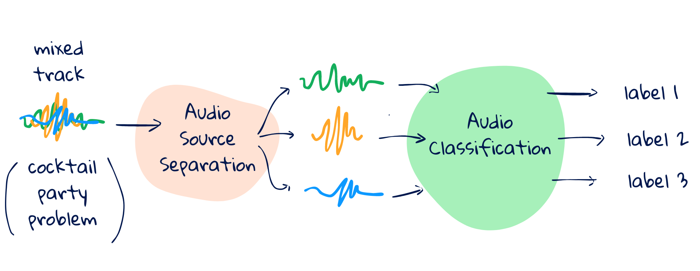

### Inga Dyląg, Paulina Skrzypczak, Karolina Źróbek

Sztuczna Inteligencja w Systemach Informatycznych 2024

---
# Klasyfikator komponentów audio

### Temat projektu
Celem projektu jest stworzenie klasyfikatora komponentów audio, który będzie w stanie rozpoznawać różne dźwięki slyszalne jednocześnie na jednym nagraniu. Przykładowo, jeśli na nagraniu znajdują się dźwięki kluczy, klawiatury i deszczu, klasyfikator będzie w stanie rozpoznać te trzy dźwięki.

Projekt łączy zatem klasyfikację audio, z problemem *coctail party problem*, który polega na rozdzieleniu wielu źródeł dźwięku, które zostały zarejestrowane jednocześnie, przy minimalnej lub braku wiedzy na temat tych źródeł.

### Metody

1. **Uczenie nienadzorowane do rozdzielania komponentów audio**: Wykorzystamy algorytm Independent Component Analysis (FastICA) z pakietu scikit-learn. FastICA jest techniką która pozwala na rozdzielenie sygnału na jego składowe niezależne.

2. **Microsoft CLAP do klasyfikacji wyodrębnionych komponentów**: 
[CLAP (Contrastive Language-Audio Pretraining)](https://ieeexplore.ieee.org/abstract/document/10095889) stworzony przez Microsoft model wykorzystujący przeawrzanie języka naturalnego do klasyfikacji audio. To podejście wykorzystuje relację między etyketami a dźwiękami, a więc relację między językiem a audio. 
CLAP dostępny jest jako wytrenowany model, który moze być wykorzystany do obliczania osadzeń słów oraz audio w jendej przestrzeni wektorowej. Pozwala to na obliczanie odległości między wektorem audio a wektorem tekstowym, co następnie pozwala na wyznaczenie najbardziej odpowiedniej etykiety dla danej próbki dźwiękowej. 

Model został wytrenowany na 128 tysiącach par audio i tekstów, a następnie przetestowany na 16 różnych zadaniach klasyfikacji dźwięków, muzyki oraz mowy.  CLAP osiąga wysoką wydajność w klasyfikacji bez potrzeby wcześniejszego treningu na etykietowanych danych (**zero-shot classfication**).
Model ten będzie wykorzystany do klasyfikacji oddzielonych wcześniej komponentów składowych audio.

### Zbiór danych
W projekcie użyjemy zbioru danych [Environmental Sound Classification 50](https://www.kaggle.com/datasets/mmoreaux/environmental-sound-classification-50?resource=download&select=esc50.csv), który zawiera sklasyfikowane pliki WAV z dźwiękami codziennego życia, takimi jak pisanie na klawiaturze, dzwonienie telefonu, szczekanie psa, deszcz itd. Do testowania modelu dodatkowo planujemy utworzyć własne próbki danych. 

### Źródła
- Piczak, K. J. (2015). Esc: Dataset for environmental sound classification. Proceedings of the 23rd ACM International Conference on Multimedia, 1015–1018.[https://doi.org/10.1145/2733373.2806390](https://doi.org/10.1145/2733373.2806390)
- Elizalde, B., Deshmukh, S., Ismail, M. A., & Wang, H. (2023). Clap learning audio concepts from natural language supervision. ICASSP 2023 - 2023 IEEE International Conference on Acoustics, Speech and Signal Processing (ICASSP), 1–5.[https://doi.org/10.1109/ICASSP49357.2023.10095889](https://doi.org/10.1109/ICASSP49357.2023.10095889)
- Model Microsoft CLAP na Githubie: (https://github.com/microsoft/CLAP.)
- Youtube: [Scikit-learn 109:Unsupervised Learning 13: Project - Separate mixed audio.](https://www.youtube.com/watch?v=v-6tYAoRZsw)
- Github: [ssspy: A Python toolkit for sound source separation.](https://github.com/tky823/ssspy)
- GeeksforGeeks: [Blind source separation using FastICA in Scikit Learn](https://www.geeksforgeeks.org/blind-source-separation-using-fastica-in-scikit-learn/)

